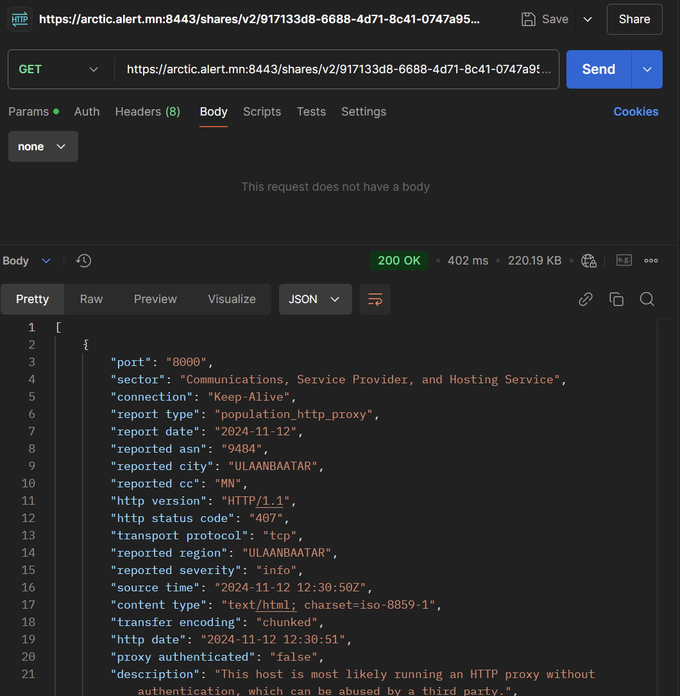

# MNCERT CTI feed хүлээн авах заавар

# Хэрхэн ашиглаж эхлэх вэ? (Getting Started)

Сүүлийн 7 хоногт танай байгууллагад хамаарах мэдээллийг хүлээн авах HTTP хүсэлт нь дараах хэлбэртэй харагдана. 

```jsx
[HTTP|GET] https://arctic.alert.mn:8443/shares/v2/917133d8-6688-4d71-8c41-0747a95156e5?apikey=$APIKEY
```

Дээрх URL-ийг дараах байдлаар ойлгоно.

1. Үндсэн URL: 
    
    https://arctic.alert.mn:8443/shares/v2/917133d8-6688-4d71-8c41-0747a95156e5
    
2. Query Parameters list: 
    
    apikey: Танай байгууллагад хамаарах ***APIKEY.*** Үүнийг MNCERT/CC-ээс үүсгүүлж авна. 
    
3. Ашиглагдах боломжтой параметрүүд 

| Параметрүүд | Тодорхойлолт | Жишээ |
| --- | --- | --- |
| `apikey` | Customer apikey | `apikey=key` |
| `start` | earliest time to include in query | `start=1476706332.94`, `start="2017-12-20 12:23:34"`, `start=-60` (60 seconds ago) |
| `end` | latest time to include in query | (see start) |
| `period` | Issue period | `period=2023-05` (only for issue shares) |
| `filter` | rule-lang expression, return only matching events | `filter=ip=203.0.113.1` |
| `projection` | limit projection to defined fields | `projection=ip,asn` |
| `sort` | sort order for the events | `sort=_id` |
| `reverse` | return elements in reverse order | `reverse` |
| `limit` | maximum number of elements to operate on. See paging | `limit=10` |
| `token` | start point for query, obtained from previous query | `token=id` |
| `accept` | accept-header alternative | `accept=application/json` |
| `delimiter` | delimiter used for CSV (default=`,`) | `delimiter=;` |

# **Жишээ**



cURL жишээ: 

```jsx
curl --location 'https://arctic.alert.mn:8443/shares/v2/917133d8-6688-4d71-8c41-0747a95156e5?apikey={redacted_API_key}'
```

# Бусад анхаарах зүйлс

Дээрх хүсэлт нь хамгийн ихдээ 1000 эвентийг харуулах боломжтой. Тиймээс танай байгууллагад хамаарах эвентийн тоо 1000-аас их байвал Pagination ашиглан дараагийн хуудсуудыг дуудна. 

3.1. Манайд хамаарах хүсэлт 1000-аас их байгаа эсэхийг шалгах 

```jsx
[HTTP|GET] https://arctic.alert.mn:8443/shares/v2/917133d8-6688-4d71-8c41-0747a95156e5/count?apikey={redacted_api_key}
```

Ажиллаж буй жишээ: 


Хэрвээ таны дуудаж буй хүсэлтэд нэг хуудасд багтахаас их хэмжээний өгөгдөл байгаа тохиолдолд 

token гэсэн query parameter-д тасалбар болгох эцсийн эвентийн uuid-г зааж өгөх шаардлагатай

жишээлбэл: 

```jsx
$: curl --location 'https://arctic.alert.mn:8443/shares/v2/917133d8-6688-4d71-8c41-0747a95156e5?apikey={redacted_api_key}&token=7f57d2d3-a6bd-4d2e-9a46-337e[973223fa](https://arctic.alert.mn:8443/shares/v2/917133d8-6688-4d71-8c41-0747a95156e5?apikey=3eb2c913-bb73-41ee-9a96-dc1a463184be&token=7f57d2d3-a6bd-4d2e-9a46-337e973223fa)'
```

Дээрх хэсэгт байх token = **7f57d2d3-a6bd-4d2e-9a46-337e973223fa** утга нь эвентийн body дотор байх UUID утга юм. Таны заасан UUI-ээс хойших эвентүүд нь дараагийн хуудсаар ирэх болно. 

